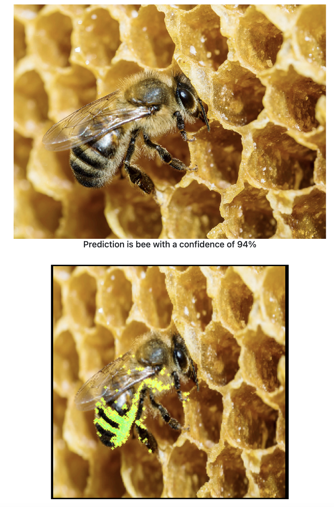
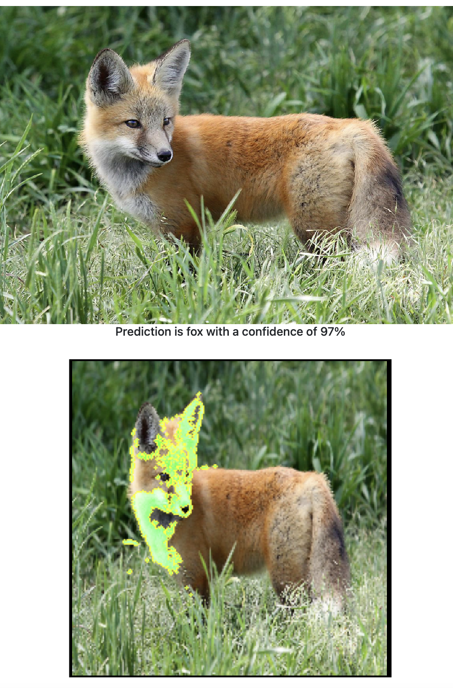
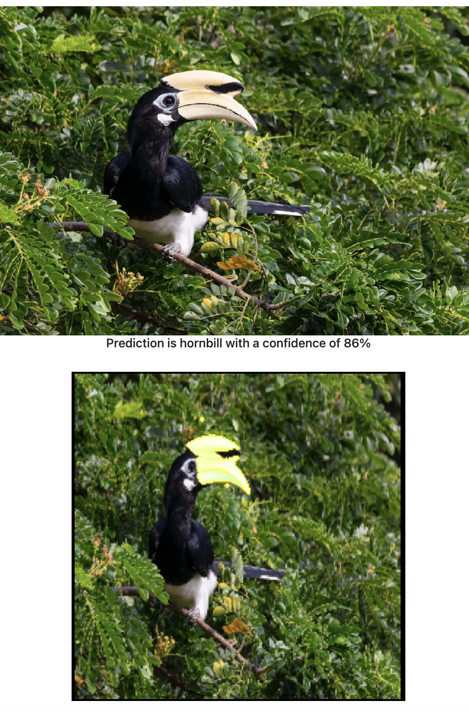

### Animal vision 

This repo contains code to (i) train a computer vision model that can recognise animals in pictures and (ii) a web application that uses this model to generate prediction for new pictures and utilises *explainable machine learning* to get an indication on why our model generated a certain prediction. 

The model is based on EfficientNet and is finetuned on a small dataset with animal photos (i.e., we apply transfer learning). To set up the web application, the Dash framework is used. Lastly, the predictions are explained using local interpretable model-agnostic explanations (LIME). In the web application, the areas that the model relies on the most to generate its prediction are highlighted in green.  

These model explanations can be useful to assess if the model actually learned to pick up relevant characteristics of the pictures that we fed it, or if it instead mostly relies on noise and spurious patterns in the data. 


### Deployment 

Clone the repository, `cd` into the relevant directory and install the dependencies in a virtual environment in the following way:

```bash
python -m venv venv
source venv/bin/activate  # Windows: \venv\scripts\activate
pip install -r requirements.txt
```

You can train the classification model via transfer learning by running: 
```bash
python train.py
```

After training the model, we are ready to test to spin up our web application: 
```bash
python main.py
```


### Example screenshots

 



### References

* https://arxiv.org/abs/1602.04938 "Why Should I Trust You?": Explaining the Predictions of Any Classifier
* https://www.kaggle.com/datasets/iamsouravbanerjee/animal-image-dataset-90-different-animals Animal dataset
